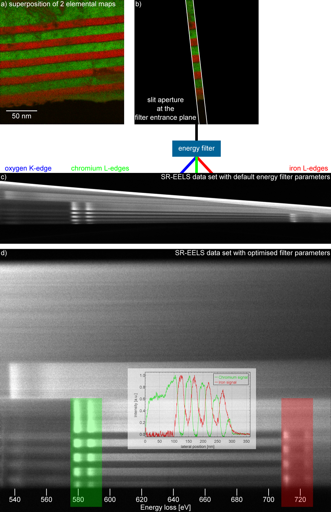

#MC2015
##Spatially resolved EELS with an in-column Omega filter - from distorted recordings to corrected results

This page contains additional information regarding my abstract for the MC2015.

###Table of Contents
1. Abstract figure
1. Software correction of image distortions
1. EFTEMj - an overview

###Abstract figure

It was only possible to upload the figures as gif or jpeg file format. Additionally the file size was limited to 400 kB. Here you can see the figure without compression artefacts. For a full resolution version click on the image.

a) A combination of three elemental maps that shows the specimen (iron in red, chromium in green and oxygen in blue) used for SR-EELS measurements.

b) This images shows how the specimen has to be aligned to perform a SR-EELS measurement. A slit aperture at the filter entrance plane is useful but not necessary.

c) A SR-EELS measurement with default parameters for the energy filter excitations. The low lateral resolution and strong distortions are visible.

d) The final SR-EELS image after optimising the energy filter excitations and post-processing of the recorded dataset with EFTEMj [3]. The inset shows the background subtracted iron L_3-edge signal.

###Software correction of image distortions

coming soon...

###EFTEMj - an overview

coming soon...
