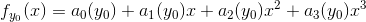
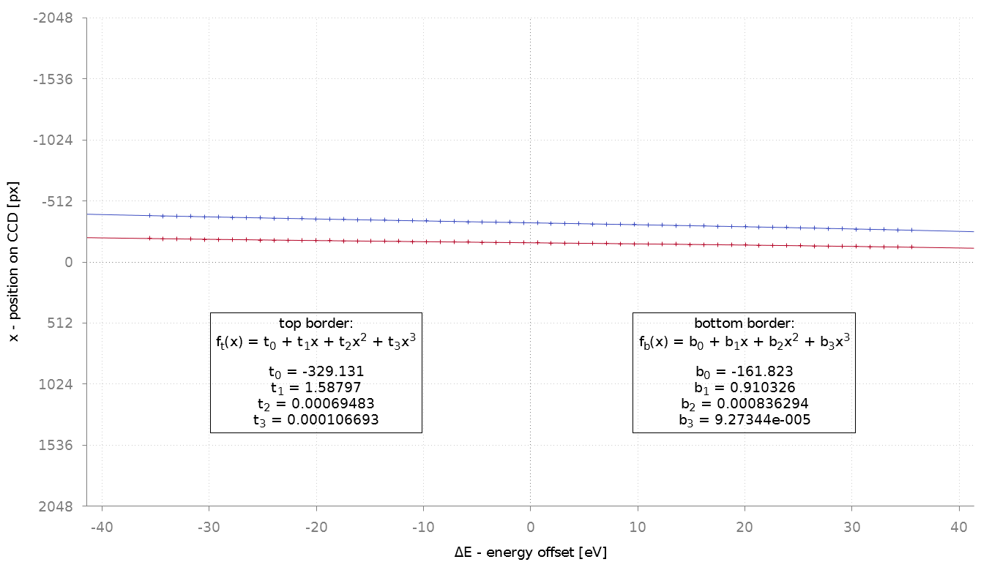
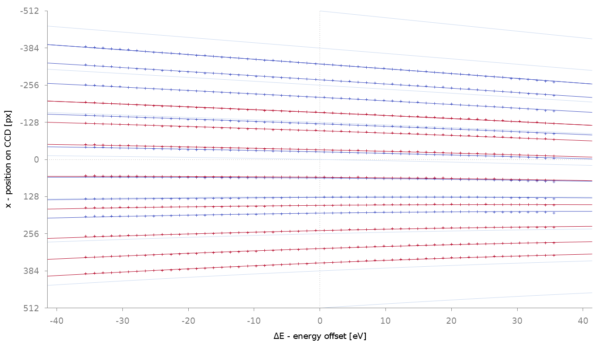

#MC2015
##Spatially resolved EELS with an in-column Omega filter - from distorted recordings to corrected results

This page contains additional information regarding my abstract for the MC2015.

###Table of Contents
1. Abstract figure
1. Software correction of image distortions
1. EFTEMj - an overview

###Abstract figure

It was only possible to upload the figures as gif or jpeg file format. Additionally the file size was limited to 400 kB. Here you can see the figure without compression artefacts. For a full resolution version click on the image.

a) A combination of three elemental maps that shows the specimen (iron in red, chromium in green and oxygen in blue) used for SR-EELS measurements.

b) This images shows how the specimen has to be aligned to perform a SR-EELS measurement. A slit aperture at the filter entrance plane is useful but not necessary.

c) A SR-EELS measurement with default parameters for the energy filter excitations. The low lateral resolution and strong distortions are visible.

d) The final SR-EELS image after optimising the energy filter excitations and post-processing of the recorded dataset with EFTEMj [3]. The inset shows the background subtracted iron L_3-edge signal.

###Software correction of image distortions

####The characterisation measurement

For each SR-EELS configuration a characterisation measurement is necessary. The parameters of a configuration are the spectrum magnification (magnification of the second projective) and &Delta;QSinK7 (the excitation change of the 7th hexapol corrector of the energy filter).

Figure 1 & figure 2 show the a characterisation measurement: The filter entrance aperture is shifted along the axis perpendicular to the energy dispersive axis (see figure 1). For each position a SR-EELS image is recorded (see figure 2). To get optimal results, an amorphous region of the specimen is used and the energy loss is set to a range that shows no edges.

**Figure 1:** This montage shows the position of the filter entrance aperture. For each position a SR-EELS image has been recorded (see figure 2).

**Figure 2:** This is the montage of the SR-EELS images used for the characterisation (315x spectrum magnification and &Delta;QSinK7=0%). You can download these file: [SR-EELS_characterisation_SM315_QSinK7=0.zip][SR-EELS_chara_example].

[SR-EELS_chara_example]: http://eftemj.entrup.com.de/SR-EELS_characterisation_SM315_QSinK7=0.zip

####Processing the characterisation images

Each SR-EELS image is processed separately. For a range of energy channels (e.g. 64 channels), the borders of the spectrum are detected. Figure 3 shows a SR-EELS image (intensity with logarithmic scale) with all detected data points as an overlay.

The characterisation is done by the ImageJ macro [SR-EELS_Characterisation.ijm](https://github.com/EFTEMj/EFTEMj/blob/master/EFTEMj/src/main/resources/macros/SR-EELS_Characterisation.ijm). It is integrated in the EFTEMj package and can be accessed by `Plugins > EFTEMj > SR-EELS > SR-EELS characterisation`.

**Figure 3:** A SR-EELS image (intensity with logarithmic scale)with all detected data points as an overlay.

####Finding Polynomials to describe the distortion

A polynomial of 3rd order (P3i) is used to fit each border. Figure 4 shows fits for the top border, the bottom border of the SR-EELS image shown in figure 3.

All borders of separate SR-EELS images can be described by only one function. The parameters of the 3rd order polynomial (P3i) vary as a function of the y-offset of each. We choose y0 = P3i(x=0) as the y-offset of the selected third order polynomial. Now we can use

where each parameter is a 2nd order polynomial. Figure 5 shows this function fitted to the data points of 8 SR-EELS images. There is nearly a perfect match.

**Figure 4:** Top and bottom borders of the SR-EELS image shown in figure 3 are fitted with separate polynomials of third order.

*Figure 5:** The series of 8 SR-EELS images has been analysed. The function f(x,y(x=0)) has been used to fit all borders simultaneously. The y-range is reduced for more details being visible. The lightblue lines show f(x,y(x=0)) for equidistant values of y(x=0).

coming soon...

####Correctiong the distortion

coming soon...

###EFTEMj - an overview

coming soon...
