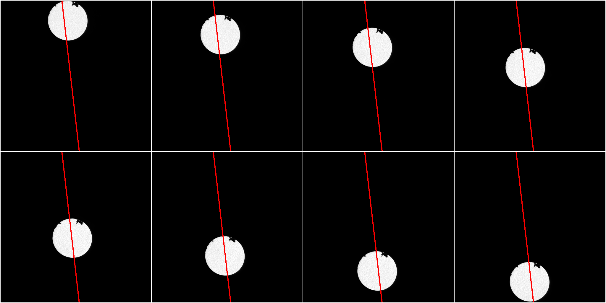
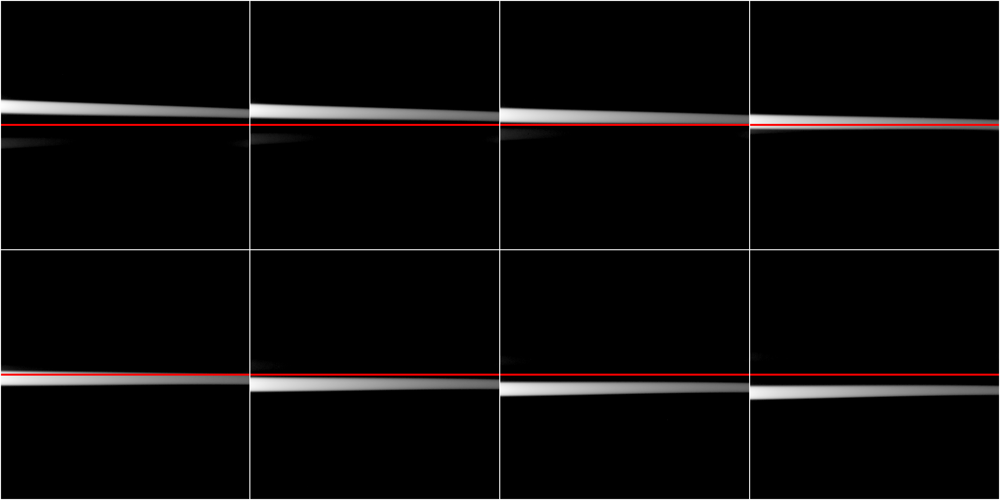

# example images for SR-EELS_characterisation.ijm

To test [SR-EELS_characterisation.ijm][SR-EELS_chara] you can download the example images as a ZIP-file:
[SR-EELS_characterisation_SM315_QSinK7=0.zip (size: 99.7 MB)][SR-EELS_chara_example].

## How to record images for the SR-EELS characterisation?

This steps are valid for a Zeiss Libra 200FE with in-column Omega-Filter.

1. Insert a uniform specimen, as this is the best choice for recording SR-EELS characterisation images.
  1. Sufficient is a specimen with a small region that is uniform at the field of view. For example there is clue at my FeCr layer systems that fulfils this requirements.
2. Centre the small round aperture at the filter entrance plane.
3. Switch to the EELS mode and choose the SpecMag and QSinK7.
4. Select an energy loss in order that no edge is visible.
5. Record the first SR-EELS image. It's best to use the mode for conventional TEM images, as the complete camera size is used.
7. The small knob will move the aperture on the axis perpendicular to the energy dispersive direction (red line at figure 1). Shift the aperture and record another image.
8. Repeat the previous step a few times. A minimum of 5 images is recommended. Figure 2 shows a series consisting of 8 images. 

**Figure 1:** This montage shows the position of the filter entrance aperture. For each position a SR-EELS image has been recorded (see figure 2).

**Figure 2:** This is the montage of the SR-EELS images used for the characterisation. You can download these file: [SR-EELS_characterisation_SM315_QSinK7=0.zip][SR-EELS_chara_example].

[SR-EELS_chara]: https://github.com/EFTEMj/EFTEMj/blob/master/EFTEMj/src/main/resources/macros/SR-EELS_characterisation.ijm
[SR-EELS_chara_example]: http://eftemj.entrup.com.de/SR-EELS_characterisation_SM315_QSinK7=0.zip
